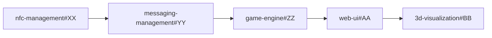

## Epic: [PM-E###] Epic Title

**Maturity Level**: Act [X] - [Maturity Level Name]  
**Target Release**: v[X.X.X] - [Release Name]  
**Epic Owner**: @[username]  
**Start Date**: [YYYY-MM-DD]  
**Target Date**: [YYYY-MM-DD]

---

## Epic Goal
<!-- High-level business objective this epic will achieve -->

**As a** [user type/stakeholder]  
**I want** [high-level capability]  
**So that** [business value/outcome]

---

## Success Criteria
<!-- How we'll know this epic is successful -->

- [ ] **Primary Success Metric**: [Specific measurable outcome]
- [ ] **Secondary Success Metric**: [Additional measurable outcome]
- [ ] **Quality Gate**: [Quality/performance requirement]
- [ ] **User Acceptance**: [User experience requirement]

---

## Microservice Breakdown

### 🔧 nfc-management
**Repository**: [nfc-management](../../../nfc-management)
**Epic Impact**: [High/Medium/Low] - [Brief description]

#### Related Issues:
- [ ] **[NFC-###]** [Story Title] - `nfc-management#[TBD]`
- [ ] **[NFC-###]** [Story Title] - `nfc-management#[TBD]`

#### Key Deliverables:
- [ ] [Specific deliverable from NFC service]
- [ ] [API endpoint or capability]
- [ ] [Integration point]

---

### 📡 messaging-management  
**Repository**: [messaging-management](../../../messaging-management)
**Epic Impact**: [High/Medium/Low] - [Brief description]

#### Related Issues:
- [ ] **[MSG-###]** [Story Title] - `messaging-management#[TBD]`
- [ ] **[MSG-###]** [Story Title] - `messaging-management#[TBD]`

#### Key Deliverables:
- [ ] [Specific deliverable from messaging service]
- [ ] [MQTT topic or message format]
- [ ] [Event processing capability]

---

### 🎮 game-engine
**Repository**: [game-engine](../../../game-engine)  
**Epic Impact**: [High/Medium/Low] - [Brief description]

#### Related Issues:
- [ ] **[GAME-###]** [Story Title] - `game-engine#[TBD]`
- [ ] **[GAME-###]** [Story Title] - `game-engine#[TBD]`

#### Key Deliverables:
- [ ] [Game logic or rule implementation]
- [ ] [State management capability]
- [ ] [API for frontend consumption]

---

### 🎨 web-ui
**Repository**: [web-ui](../../../web-ui)
**Epic Impact**: [High/Medium/Low] - [Brief description]

#### Related Issues:
- [ ] **[UI-###]** [Story Title] - `web-ui#[TBD]`
- [ ] **[UI-###]** [Story Title] - `web-ui#[TBD]`

#### Key Deliverables:
- [ ] [UI component or page]
- [ ] [User interaction capability]
- [ ] [Frontend integration]

---

### 🌐 3d-visualization
**Repository**: [3d-visualization](../../../3d-visualization)
**Epic Impact**: [High/Medium/Low] - [Brief description]

#### Related Issues:
- [ ] **[VIZ-###]** [Story Title] - `3d-visualization#[TBD]`
- [ ] **[VIZ-###]** [Story Title] - `3d-visualization#[TBD]`

#### Key Deliverables:
- [ ] [3D model or scene]
- [ ] [BabylonJS component]
- [ ] [Real-time update capability]

---

### 🔗 pipedream-integration
**Repository**: [pipedream-integration](../../../pipedream-integration)
**Epic Impact**: [High/Medium/Low] - [Brief description]

#### Related Issues:
- [ ] **[PIPE-###]** [Story Title] - `pipedream-integration#[TBD]`
- [ ] **[PIPE-###]** [Story Title] - `pipedream-integration#[TBD]`

#### Key Deliverables:
- [ ] [Database integration]
- [ ] [External API connection]
- [ ] [Data pipeline capability]

---

## Cross-Service Dependencies

### Critical Path Dependencies

