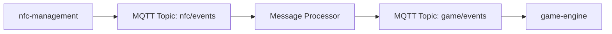

## User Story: [SERVICE-###] Story Title

**Epic**: [project-management#XX](../../../project-management/issues/XX) - [Epic Name]
**Service**: [Service Name]
**Component**: [Service Component/Module] **Story Owner**: @[username]
**Sprint**: [Sprint Name/Number or TBD]

---

## Story Description

**As a** [user/service/system]
**I want** [functionality/capability]
**So that** [business value/outcome]

### Context
<!-- Provide background information and context for this story -->

### Business Value
<!-- Explain why this story is important and what value it delivers -->

---

## Acceptance Criteria

### Functional Requirements
- [ ] **AC1**: [Specific, testable criterion]
- [ ] **AC2**: [Specific, testable criterion]
- [ ] **AC3**: [Specific, testable criterion]

### Non-Functional Requirements
- [ ] **Performance**: [Response time, throughput requirements]
- [ ] **Security**: [Security considerations or requirements]
- [ ] **Reliability**: [Error handling, availability requirements]
- [ ] **Maintainability**: [Code quality, documentation requirements]

---

## Service Architecture Impact

### Components Modified
- [ ] **[Component Name]**: [Description of changes]
- [ ] **[Component Name]**: [Description of changes]

### New Components Added
- [ ] **[Component Name]**: [Description and purpose]

### Database Changes
- [ ] **Schema Changes**: [Description of database modifications]
- [ ] **Migration Required**: [Yes/No - If yes, link to migration script]
- [ ] **Data Impact**: [Description of data changes or requirements]

---

## Integration Points

### Inbound Dependencies (Services that call this service)
- **[Service Name]**: [Description of how they consume this functionality]
  - **Issue Link**: [service-repo#issue] - [Brief description]
  - **Integration Type**: [API, Message, Database, etc.]
  - **Contract**: [Link to API spec or message schema]

### Outbound Dependencies (Services this story depends on)
- **[Service Name]**: [Description of dependency]
  - **Issue Link**: [service-repo#issue] - [Brief description]
  - **Integration Type**: [API, Message, Database, etc.]
  - **Blocking**: [Yes/No - Does this block current story?]

### Cross-Service Coordination Required
- [ ] **[Service A]** and **[Service B]** need coordinated deployment
- [ ] **API Contract** changes require consumer notification
- [ ] **Message Schema** changes need backward compatibility
- [ ] **Database Migration** affects multiple services

---

## Technical Implementation

### Approach Overview
<!-- High-level technical approach for implementing this story -->

### API Changes
```markdown
### New Endpoints
- `[METHOD] /endpoint/path` - [Description]
  - Request: [Brief request format]
  - Response: [Brief response format]
  - Status Codes: [Expected status codes]

### Modified Endpoints
- `[METHOD] /endpoint/path` - [Description of changes]
  - **Breaking Change**: [Yes/No]
  - **Migration Path**: [How consumers should adapt] ```

### Message/Event Changes

```markdown
### New Messages/Events
- **Event Type**: `event_name`
- **Schema**: [Link to schema or inline definition]
- **Publishing**: [When/where this event is published]
- **Consumers**: [Which services consume this event]

### Modified Messages/Events
- **Event Type**: `event_name`
- **Changes**: [Description of schema changes]
- **Backward Compatible**: [Yes/No]
```

### Configuration Changes

- [ ] **Environment Variables**: [New or modified env vars]
- [ ] **Feature Flags**: [Any feature flags needed]
- [ ] **Service Discovery**: [Changes to service registration]

-----

## Testing Strategy

### Unit Testing

- [x] **Test Coverage Target**: [X]% for new/modified code
- [ ] **Key Test Cases**:
  - [ ] [Happy path test description]
  - [ ] [Error condition test description]
  - [ ] [Edge case test description]

### Integration Testing

- [ ] **Service Integration Tests**: Test integration points with dependent services
- [ ] **Contract Testing**: Validate API contracts with consumers
- [ ] **Database Integration**: Test database operations and migrations

### End-to-End Testing

- [ ] **Epic Flow Testing**: Validate story contributes to epic end-to-end flow
- [ ] **Performance Testing**: [If applicable - performance requirements]

-----

## Definition of Ready Checklist

- [ ] **User story clearly defined** with acceptance criteria
- [ ] **Epic linkage established** and epic owner consulted
- [ ] **Cross-service dependencies identified** and coordinated
- [ ] **Technical approach documented** and reviewed
- [ ] **API/Message contracts defined** (if applicable)
- [ ] **Database changes planned** (if applicable)
- [ ] **Story points estimated** by development team
- [ ] **Required resources available** (team capacity, external dependencies)
- [ ] **Acceptance criteria are testable** and measurable

-----

## Definition of Done Checklist

### Development Complete

- [ ] **Code implemented** according to acceptance criteria
- [ ] **Code reviewed** and approved by team member
- [ ] **Unit tests written** and achieving target coverage
- [ ] **Integration tests passing** for affected components

### Quality Assurance

- [ ] **Manual testing completed** against acceptance criteria
- [ ] **Cross-service integration verified** (if applicable)
- [ ] **Performance requirements met** (if applicable)
- [ ] **Security review completed** (if security implications)

### Documentation and Communication

- [ ] **API documentation updated** (if API changes)
- [ ] **README/technical docs updated** (if applicable)
- [ ] **Database migration documented** (if schema changes)
- [ ] **Consumer services notified** of contract changes

### Deployment Ready

- [ ] **Feature deployed to development environment**
- [ ] **Configuration changes applied** to target environments
- [ ] **Database migrations tested** in lower environments
- [ ] **Rollback plan documented** and tested

### Epic Coordination

- [ ] **Epic owner notified** of story completion
- [ ] **Integration checkpoints met** with dependent services
- [ ] **Story contributes to epic goals** as expected

-----

## Estimation and Planning

### Story Points: [TBD]

**Estimation Session Date**: [Date]
**Participants**: [List team members who participated]

### Estimation Breakdown

- **Development Effort**: [X] points
- **Testing Effort**: [X] points
- **Integration Complexity**: [X] points
- **Risk/Uncertainty**: [X] points

### Sprint Assignment

- **Target Sprint**: [Sprint name/number]
- **Sprint Goal Alignment**: [How this story supports sprint goal]
- **Sprint Capacity Impact**: [X]% of sprint capacity

-----

## Risks and Mitigation

### Technical Risks

|Risk              |Impact      |Probability |Mitigation           |
|------------------|------------|------------|---------------------|
|[Risk description]|High/Med/Low|High/Med/Low|[Mitigation strategy]|

### Dependency Risks

- **Blocking Dependencies**: [List dependencies that could block this story]
- **Timeline Risks**: [Schedule constraints or concerns]
- **Resource Risks**: [Availability concerns for required skills/people]

### Mitigation Plans

- [ ] **Risk 1 Mitigation**: [Specific steps to mitigate]
- [ ] **Risk 2 Mitigation**: [Specific steps to mitigate]

-----

## Cross-Service Communication

### Stakeholders to Notify

- [ ] **Epic Owner** (@[username]): Story status and completion
- [ ] **Dependent Service Teams**: [List teams that depend on this work]
- [ ] **Consumer Service Teams**: [List teams that consume this service]
- [ ] **Platform/Infrastructure**: [If infrastructure changes needed]

### Communication Plan

- **Status Updates**: [How often and via what channel]
- **Blocking Issues**: [Escalation path for blockers]
- **Completion Notification**: [Who to notify when done]

-----

## Implementation Notes

### Development Log

<!-- Use this section for implementation notes, decisions, and progress updates -->

**[Date]** - Story created and added to backlog
**[Date]** - [Significant decision or progress update]
**[Date]** - [Integration point clarified with team X]
**[Date]** - [Story completed and ready for testing]

### Key Technical Decisions

- **[Date]**: [Decision made and rationale]
- **[Date]**: [Decision made and rationale]

### Lessons Learned

- [What went well during implementation]
- [What could be improved for future stories]
- [Insights about cross-service coordination]

-----

## Related Issues and Pull Requests

### Related Issues

- **Epic**: [project-management#XX](../../../project-management/issues/XX)
- **Dependencies**: [service-repo#issue], [service-repo#issue]
- **Related Stories**: [current-repo#issue], [current-repo#issue]

### Pull Requests

- [ ] **Main Implementation**: [Link to PR when created]
- [ ] **Database Migration**: [Link to PR when created]
- [ ] **Configuration Changes**: [Link to PR when created]
- [ ] **Documentation Updates**: [Link to PR when created]

### Integration Testing Issues

- [ ] **Cross-Service Testing**: [Link to integration test issue]
- [ ] **Epic End-to-End Testing**: [Link to epic-level test issue]

```
---

## Service-Specific Template Examples

### For NFC Management Service

**File**: `nfc-management/.github/ISSUE_TEMPLATE/nfc-user-story.md`

```markdown
---
name: NFC User Story
about: Create a user story for NFC management service
title: '[NFC-###] Story Title'
labels: ['user-story', 'nfc', 'hardware', 'needs-estimation']
assignees: ''
---

## User Story: [NFC-###] Story Title

**Epic**: [project-management#XX](../../../project-management/issues/XX) - [Epic Name]
**Service**: NFC Management
**Component**: [Hardware Interface | Event Processing | Configuration | Monitoring]

<!-- Include all sections from main template above -->

### NFC-Specific Sections

#### Hardware Requirements
- [ ] **NFC Reader Model**: [Specific hardware model/version]
- [ ] **Tag Types Supported**: [List of supported NFC tag types]
- [ ] **Connection Type**: [USB/Serial/Network connection details]

#### NFC Event Schema
```json
{
  "event_type": "nfc_tag_detected",
  "tag_id": "string",
  "reader_position": "pentagon_vertex_1",
  "timestamp": "2025-08-11T10:30:00Z",
  "signal_strength": "number",
  "tag_data": "object"
}
```

#### Integration with Messaging Service

- **Outbound**: messaging-management via MQTT topic `nfc/events`
- **Contract**: [Link to message schema specification]

```
### For Messaging Management Service

**File**: `messaging-management/.github/ISSUE_TEMPLATE/messaging-user-story.md`

```markdown
---
name: Messaging User Story
about: Create a user story for messaging management service
title: '[MSG-###] Story Title'
labels: ['user-story', 'messaging', 'mqtt', 'needs-estimation']
assignees: ''
---

## User Story: [MSG-###] Story Title

**Epic**: [project-management#XX](../../../project-management/issues/XX) - [Epic Name]
**Service**: Messaging Management
**Component**: [MQTT Broker | Event Router | Message Processor | Queue Manager]

<!-- Include all sections from main template above -->

### Messaging-Specific Sections

#### MQTT Configuration
- [ ] **Broker**: [Broker type and version]
- [ ] **Topics**: [List of topics this story affects]
- [ ] **QoS Levels**: [Quality of service requirements]
- [ ] **Retention Policy**: [Message retention requirements]

#### Message Flow


#### Event Processing Logic

- **Input Events**: [Types of events processed]
- **Transformation Rules**: [How messages are transformed]
- **Output Events**: [Types of events produced]

```
